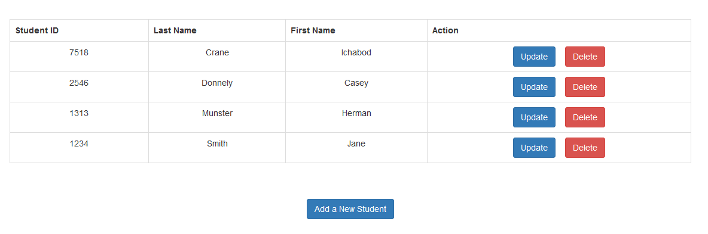
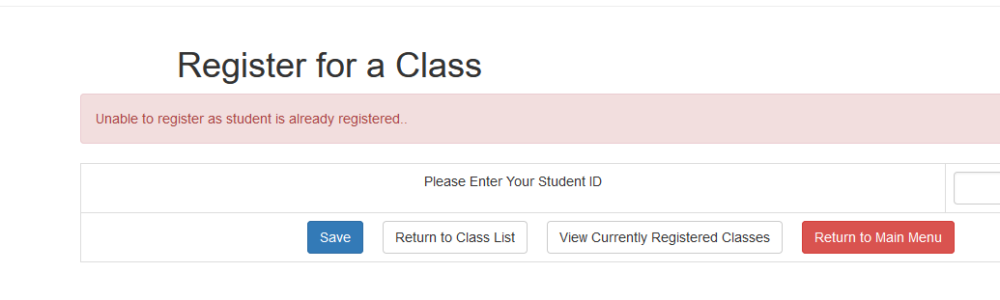
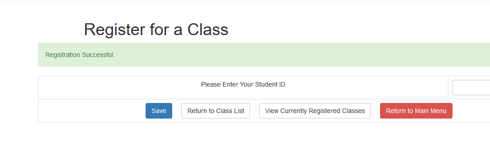

## Student Registration Portal  
This portfolio outlines a student registration portal for a fictional college called Loney University.  The portal contains the critical elements to register for a class, including a database consisting of the registered students and the available courses for registration.  Functionality has been built, using mySQL and PHP, to register for classes and view registrations once they have been made.  There have also been admin pages added to perform general CRUD operations on the student and class tables via an html interface.  

For reference, the full code can be viewed on [my GitHub portal](https://github.com/Thelius42/studentRegistrationPortal)

### Professional Self Assessment


### Phase 1

For the first phase of this project, I developed and planned the setup.  The setup was based on a design from a college course, where we had planned a student registration portal.  I decided to build that planned project from scratch for this portfolio.  The question was in how to approach it from a coding perspective.  

In the end, I decided to code it in PHP with a mySQL database.  For the look and feel of the overall site, I decided to use jquery and bootstrap styling rules for the look of the buttons and the alerts in particular.  Once I had settled on this layout, I built the database and the basic index.html home page for the site, as well as got a localhost webserver up and running on my workstation.

Below is a sample of some of that bootstrap code at work:


```markdown
This code sets up the button clicks on the main page

<a href='getClasses.php' class ="btn btn-primary"> Register for a Class</a>&nbsp &nbsp &nbsp &nbsp &nbsp &nbsp
<a href='viewRegistered.php' class ="btn btn-primary"> View Registered Classes</a> 

```

For an example of how the look came out, the site is published at [ianmloney.com](http://ianmloney.com) and is fully functional.  The original narrative for this section is located [here](narrative1.md)

### Phase 2

For the second phase, I focused on the administrative pages of the site.  I created a page for modifying each of the classes and students tables.  Upon launch, the entries for each table are listed.  This is using php to pull a basic GET query on the table and listing the contents in a bootstrap table output. Below is the table syntax code and a screenshot of the result:

```markdown
echo "<tr>";
	echo "<td>{$studentID}</td>";
	echo "<td>{$lastName}</td>";
	echo "<td>{$firstName}</td>";
   echo "<td>";
// Button to update the student record
   echo "<a href='updateStudent.php?studentID={$studentID}' class='btn btn-primary m-r-1em'>Update</a> &nbsp &nbsp" ;
   // Button to delete the student record
     echo "<a href='#' onclick='delete_user({$studentID});'  class='btn btn-danger'>Delete</a>";  
    	echo "</td>";
	echo "</tr>";

```

The table includes buttons for each printout for update and delete functions.  The update links to a page with form fields to update the entries for that student.  The delete pops a confirmation dialog javascript, that upon acceptance runs a deleteStudent php scrip that deletes the record from the database.


```markdown
<script type='text/javascript'>
// confirm record deletion
function delete_user(studentID ){	
	var answer = confirm('Are you sure?');
	if (answer){
		// if user clicked ok, 
		// pass the Student id to delete.php and execute the delete query
		window.location = 'deleteStudent.php?studentID=' + studentID;
	} 
}
</script>
```
The end result of this part of the functionality can be viewed at the [maintainStudents](http://ianmloney.com/maintainStudent.php) page on the site.

### Phase 3

The final phase of this project included the registration functionality of the site as well as the ability to view classes once registered.  This involved building a list of classes similar to the maintain list in the previous phase, but this time linking out to a page to register for the class.  The class ID is carried over as a variable input, then a form asks for the student ID.  The registration page then checks if the student ID exists in the table, returning an error if it does not.  If it exists but the class is already registered, it will return an error as well.  Otherwise the registration is entered.

The way this was accomplished was by creating a third SQL database table consisting of student ID's and class ID's only.  This table has a parameter in its SQL code only allowing for unique entries as shown:

```markdown
CREATE TABLE class_student (
	regID int AUTO_INCREMENT,
	studentID int NOT NULL,
	classID varchar(5) NOT NULL,
	PRIMARY KEY (regID)
	CONSTRAINT Uniq_reg UNIQUE (studentID, classID)
);
```
Below are screenshots of both a failed registration due to duplicate entry and a successful registration.  Full functionality can be viewed at [the registration page](http://ianmloney.com/getClasses.php).





Finally we have the page to view final registered classes.  This page also includes a form field to enter a student ID.  Once the student ID is verified as existing, a query is run with an INNER JOIN on the classes table to pull the class info related to that student.  Below is the code for the SQL query from the site

```markdown
$query = "SELECT classes.classID, classes.className, classes.classDescription, classes.timeOfClass, class_student.studentID
FROM classes
INNER JOIN class_student ON class_student.classID = classes.classID            
WHERE class_student.studentID = :studentID ";
$stmt = $con->prepare($query);

$studentID=htmlspecialchars(strip_tags($_POST['studentID']));
$stmt->bindParam(':studentID', $studentID);
$stmt->execute();
```

The :studentID represents the student ID entered in the earlier code.  The table output is a look similar to the tables produced in other sections of the site.  Functionality can be seen at the [view registered site](http://ianmloney.com/viewRegistered.php).  For student IDs, they are listed on the maintain students page.
